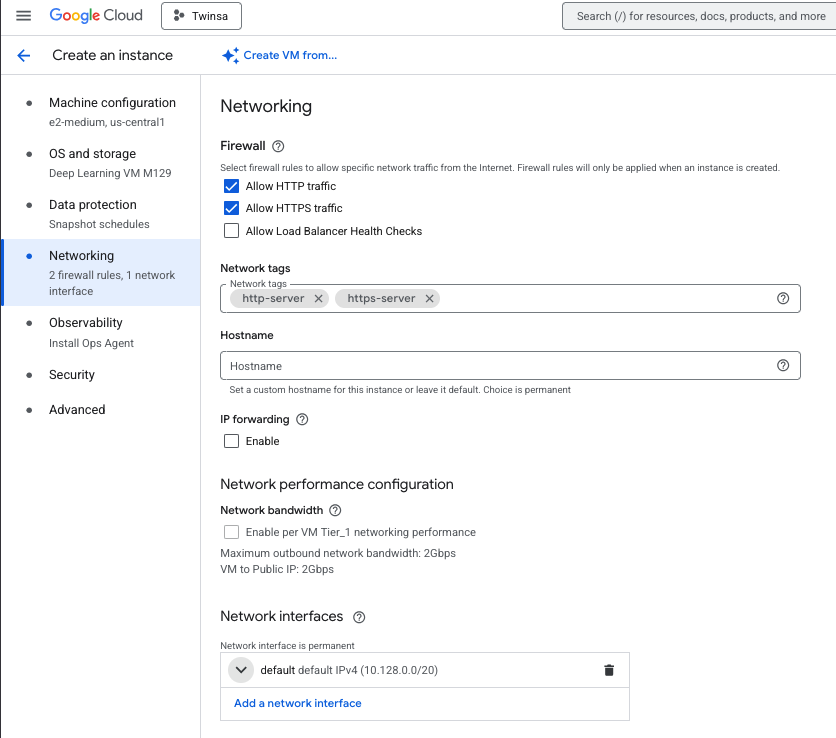

# Deploy a Docker application on Google Cloud Platform

This tutorial is a follow-up to the [Docker tutorial](docker.md). Make sure you have completed it before starting this one.
We will deploy the dockerized MNIST application (API + Gradio interface) to Google Cloud Platform.

## 1. Google cloud account and free coupon code
Click on the link sent by email to redeem your free coupon code (you must use your INSA mail address to redeem it).
Once you have your coupon code, go to [this link](https://console.cloud.google.com/education?pli=1) to get your credits (you will need a Google account, if needed, you can create one using your INSA mail address).


## 2. Create a new instance
On the GCloud homepage, click on the side bar menu on the left and select "Compute Engine" -> "VM instances".
  
Then click on the "Create project button", and create a project named _Twinsa_. No need to fill in the other fields.
  
You should arrive at the following page, click on "Enable API"
  
You should now see a page proposing to create a new instance. Click on "Create instance".
Fill in the following fields in __Machine configuration__ section:
  
Then in the __OS and Storage__ section, click on the "Change" button and select "Deep Learning in Linux" and select the first option.
  
Then in the __Networking__ section, set the following fields:
  
In this same Networking section under __Network interfaces__, click the ▾ arrow next to
__default default IPv4 (10.128.0.0/20)__.

Find __External IPv4 address dropdown__  and select  __Reserve static address__.
Give it a name like docker-mnist-static-ip and click on __Reserve__.  
  
Then click on the "Create" button to create the instance.

## 3. Install the GCloud SDK on your local machine
Now install the GCloud SDK on your local machine. Follow the instructions [here](https://cloud.google.com/sdk/docs/install).

Once the GCloud SDK is installed, run the following command to initialize it:
```console
gcloud init
```
This will guide you through the process of setting up your GCloud SDK. You will need to authenticate with your Google account and set a default project (Twinsa in our case). No need to set a default region.

## 4. Connect to your instance
Once your instance is created, you can find its name in the VM instances list on the Google Cloud Platform console.
You can connect to it using the following command (replace `your_instance_name` with the actual instance name):
```console
gcloud compute ssh --zone "us-central1-c" "your_instance_name"
```
You should now be connected to your instance and see its terminal.

## 5. Install Docker on the instance
On the instance terminal, run the following commands to install Docker:
```console
sudo apt-get update
sudo curl -SL https://github.com/docker/compose/releases/download/v2.40.3/docker-compose-linux-x86_64 -o /usr/local/bin/docker-compose
sudo chmod +x /usr/local/bin/docker-compose
sudo systemctl start docker
sudo systemctl enable docker
```

Verify Docker is installed correctly:
```console
sudo docker --version
sudo docker-compose --version
```

## 6. Prepare your local project
Make sure your local MNIST project (from the Docker tutorial) has the following structure:
```
mnist-docker-app/
├── Dockerfile-api
├── Dockerfile-gradio
├── docker-compose.yml
├── requirements-api.txt
├── requirements-gradio.txt
├── mnist_api.py
├── mnist_gradio.py
├── weights/
│   └── mnist_net.pth
└── (other files from your MNIST project)
```

Before deploying, we need to configure the firewall to allow traffic on the ports used by our application.

## 7. Configure firewall rules
On your local machine terminal (not on the instance), run the following commands to allow incoming traffic on ports 5075 (API) and 7860 (Gradio):
```console
gcloud compute firewall-rules create allow-mnist-api --allow tcp:5075
gcloud compute firewall-rules create allow-mnist-gradio --allow tcp:7860
```

## 8. Deploy by copying files directly
We will now deploy our application by copying the files to the instance.

On the instance terminal, run the following command to get your current working directory:
```console
pwd
```
This gives you the path to the home directory of the user on the instance. You should see something like `/home/your_username`.

Now on a separate terminal on your local machine, navigate to your MNIST project directory and run the following command to send the folder to the instance:
```console
gcloud compute scp --recurse --zone "us-central1-c" "." "your_instance_name":/home/your_username/mnist-docker-app/
```

Then on the instance terminal, go to the folder:
```console
cd mnist-docker-app
```

Now start the application using docker-compose:
```console
sudo docker-compose up -d
```

The `-d` flag runs the containers in detached mode (in the background).

Now go to the Google Cloud Platform console to get the external IP address of your instance.


You should now be able to access:
- The Gradio interface at `http://your_instance_ip:7860`
- The API at `http://your_instance_ip:5075`

Test the Gradio interface by drawing a digit and checking if it gets predicted correctly.

If you want to make changes to your application, simply modify the files on your local machine and repeat the `gcloud compute scp` command to copy the updated files to the instance. Then restart the containers:
```console
sudo docker-compose down
sudo docker-compose up -d
```

## 9. Deploy using Docker images
Instead of copying all the source files and building on the instance, we can build Docker images locally and transfer them to the instance. This approach is more efficient, especially for larger applications.

### Step 1: Build images locally
On your local machine, navigate to your MNIST project directory and build the Docker images:
```console
sudo docker build -f Dockerfile-api -t mnist-flask-app:latest .
sudo docker build -f Dockerfile-gradio -t mnist-gradio-app:latest .
```

Verify the images were created:
```console
sudo docker image ls
```

You should see both `mnist-flask-app` and `mnist-gradio-app` in the list.

### Step 2: Save images to tar files
Save the Docker images as tar files that can be transferred:
```console
sudo docker save mnist-flask-app:latest | gzip > mnist-flask-app.tar.gz
sudo docker save mnist-gradio-app:latest | gzip > mnist-gradio-app.tar.gz
```

These compressed tar files contain everything needed to run the containers, including all dependencies and your code.

### Step 3: Transfer images to the instance
Use `gcloud compute scp` to transfer the image files to your instance:
```console
gcloud compute scp --zone "us-central1-c" mnist-flask-app.tar.gz "your_instance_name":/home/your_username/
gcloud compute scp --zone "us-central1-c" mnist-gradio-app.tar.gz "your_instance_name":/home/your_username/
```

Also transfer the docker-compose.yml file:
```console
gcloud compute scp --zone "us-central1-c" docker-compose.yml "your_instance_name":/home/your_username/
```

### Step 4: Load images on the instance
Connect to your instance:
```console
gcloud compute ssh --zone "us-central1-c" "your_instance_name"
```

Load the Docker images from the tar files:
```console
sudo docker load < mnist-flask-app.tar.gz
sudo docker load < mnist-gradio-app.tar.gz
```

Verify the images are loaded:
```console
sudo docker image ls
```

You should see both images listed.

### Step 5: Run the application
Start the application using docker-compose:
```console
sudo docker-compose up -d
```

Check that the containers are running:
```console
sudo docker-compose ps
```

Your application should now be accessible at:
- The Gradio interface at `http://your_instance_ip:7860`
- The API at `http://your_instance_ip:5075`

### Step 6: Updating the application
When you make changes to your application, follow these steps:

1. On your local machine, rebuild the images:
```console
sudo docker build -f Dockerfile-api -t mnist-flask-app:latest .
sudo docker build -f Dockerfile-gradio -t mnist-gradio-app:latest .
```

2. Save the updated images:
```console
sudo docker save mnist-flask-app:latest | gzip > mnist-flask-app.tar.gz
sudo docker save mnist-gradio-app:latest | gzip > mnist-gradio-app.tar.gz
```

3. Transfer to the instance:
```console
gcloud compute scp --zone "us-central1-c" mnist-flask-app.tar.gz "your_instance_name":/home/your_username/
gcloud compute scp --zone "us-central1-c" mnist-gradio-app.tar.gz "your_instance_name":/home/your_username/
```

4. On the instance, stop the containers, load the new images, and restart:
```console
sudo docker-compose down
sudo docker load < mnist-flask-app.tar.gz
sudo docker load < mnist-gradio-app.tar.gz
sudo docker-compose up -d
```

### Advantages of this approach
- **Faster deployment**: No need to rebuild on the instance
- **Consistent builds**: The exact same image that works on your local machine runs on the instance
- **Easier troubleshooting**: If it works locally, it will work on the instance
- **Better resource usage**: The instance doesn't need to download and compile dependencies

### Cleanup local tar files
After successful deployment, you can delete the tar files to save disk space:

On your local machine:
```console
rm mnist-flask-app.tar.gz mnist-gradio-app.tar.gz
```

On the instance:
```console
rm mnist-flask-app.tar.gz mnist-gradio-app.tar.gz
```

## 10. Monitoring your application
You can monitor your Docker containers by connecting to the instance and running:

```console
# Connect to instance
gcloud compute ssh --zone "us-central1-c" "your_instance_name"

# Check running containers
sudo docker-compose ps

# View logs
sudo docker-compose logs

# View logs for specific service
sudo docker-compose logs api
sudo docker-compose logs gradio-app

# Follow logs in real-time
sudo docker-compose logs -f
```

## 11. Troubleshooting

Here are common issues you might encounter and their solutions:

### Firewall Issues
**Problem:** Cannot access the application via external IP.
**Solution:**
- Verify the firewall rules were created: `gcloud compute firewall-rules list`
- Make sure the rules allow tcp:5075 and tcp:7860
- Check if the containers are running on the instance: `sudo docker-compose ps`

### SSH Connection Problems
**Problem:** Cannot SSH into the instance.
**Solution:**
- Verify the instance is running in the GCP console
- Check your zone is correct (should be `us-central1-c`)
- Try adding `--verbosity=debug` to the SSH command to see detailed error messages
- Make sure your gcloud SDK is authenticated: `gcloud auth list`

### Docker Issues
**Problem:** Docker commands fail or containers don't start.
**Solution:**
- Verify Docker is installed: `sudo docker --version`
- Check Docker service status: `sudo systemctl status docker`
- View container logs: `sudo docker-compose logs`
- Restart Docker service: `sudo systemctl restart docker`
- Check disk space: `df -h` (Docker images can take a lot of space)

### Port Already in Use
**Problem:** Error message "Address already in use" when starting containers.
**Solution:**
- Stop all running containers: `sudo docker-compose down`
- Check if processes are using the ports: `sudo lsof -i :5075` and `sudo lsof -i :7860`
- Kill the processes if needed: `sudo kill -9 <PID>`

### File Transfer Issues
**Problem:** `gcloud compute scp` fails or is very slow.
**Solution:**
- Check your internet connection
- Verify the instance name and zone are correct
- For large files, consider using compression: `tar -czf` before transfer
- Check disk space on both local machine and instance: `df -h`

### Missing Model Weights
**Problem:** API fails with "model file not found" error.
**Solution:**
- Make sure the `weights/` directory and `mnist_net.pth` file exist in your local project
- Verify the model path in `Dockerfile-api` matches your actual file location
- When using the file copy method (Section 8), ensure the weights folder is copied: check with `ls -la mnist-docker-app/weights/` on the instance
- When using Docker images (Section 9), the weights are included in the image. Verify the image was built correctly and loaded on the instance

### Containers Build but Don't Communicate
**Problem:** Gradio interface cannot connect to the API.
**Solution:**
- Verify both containers are running: `sudo docker-compose ps`
- Check the API URL in `mnist_gradio.py` is set to `http://api:5075/predict`
- Make sure the `depends_on` directive is in the `docker-compose.yml`
- Check logs for both services: `sudo docker-compose logs`

### Out of Disk Space
**Problem:** Cannot build images or load images due to insufficient disk space.
**Solution:**
- Remove unused Docker resources: `sudo docker system prune -a`
- Check disk usage: `df -h`
- Remove old images: `sudo docker image prune -a`
- Delete the tar.gz files after loading images: `rm *.tar.gz`
- Consider increasing the instance's disk size in GCP console

### Docker Images Not Loading
**Problem:** `docker load` command fails or doesn't show the image.
**Solution:**
- Verify the tar.gz file is not corrupted: check file size with `ls -lh`
- Make sure you used `gzip` when saving: `docker save ... | gzip > file.tar.gz`
- Try decompressing first: `gunzip mnist-flask-app.tar.gz` then `docker load < mnist-flask-app.tar`
- Check Docker service is running: `sudo systemctl status docker`

## 12. Cleanup
To cleanup, you can stop the Docker containers and the instance:

On the instance terminal:
```console
# Stop containers
sudo docker-compose down

# Remove Docker images (optional)
sudo docker image rm mnist-flask-app:latest mnist-gradio-app:latest

# Remove tar files
rm mnist-flask-app.tar.gz mnist-gradio-app.tar.gz
```

You can stop the instance from the Google Cloud Platform console.
You can delete it if you want to completely remove it, but you might want to keep it for your project since it is configured now. If you choose to keep it, you can start it again later.

**Always remember to stop the instance when you are not using it to avoid unnecessary charges.** You have a limited $50 credit so be careful with your usage.

You can also:
- Delete the firewall rules: `gcloud compute firewall-rules delete allow-mnist-api` and `gcloud compute firewall-rules delete allow-mnist-gradio`
- Delete local tar files: `rm mnist-flask-app.tar.gz mnist-gradio-app.tar.gz`
- Keep your local Docker images for future deployments or remove them: `sudo docker image rm mnist-flask-app:latest mnist-gradio-app:latest`
