# Deploy a web app on Google Cloud Platform


## 1. Google cloud account and free coupon code
Click on the link sent by email to redeem your free coupon code (you must use your INSA mail address to redeem it).  
Once you have your coupon code, go to [this link](https://console.cloud.google.com/education?pli=1) to get your credits (you will need a Google account, if needed, you can create one using your INSA mail address).  
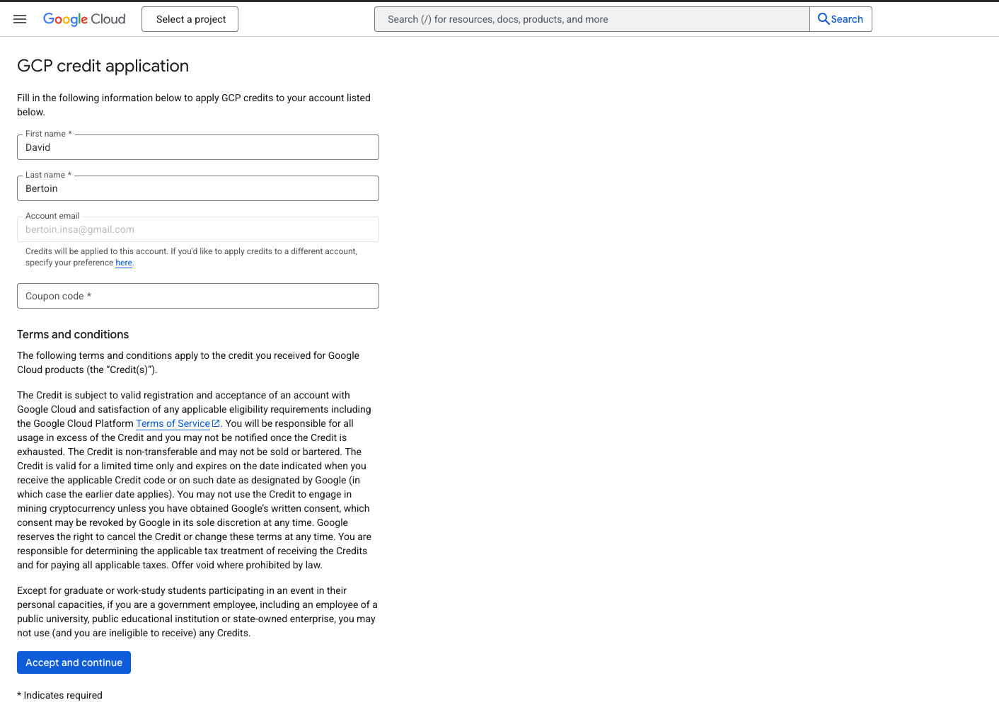  

## 2. Create a new instance
On the GCloud homepage, click on the side bar menu on the left and select "Compute Engine" -> "VM instances".  
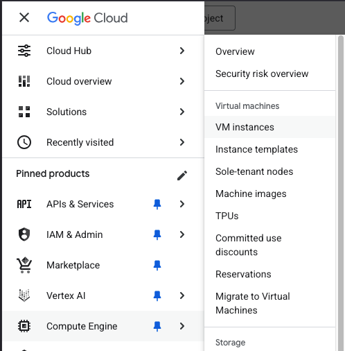  
Then click on the "Create project button", and create a project named _Twinsa_. No need to fill in the other fields.
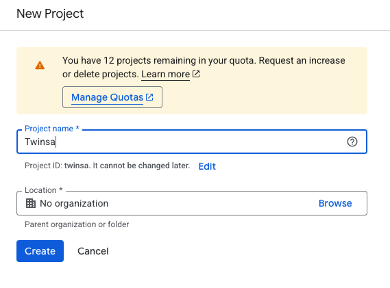  
You should arrive at the following page, click on "Enable API"
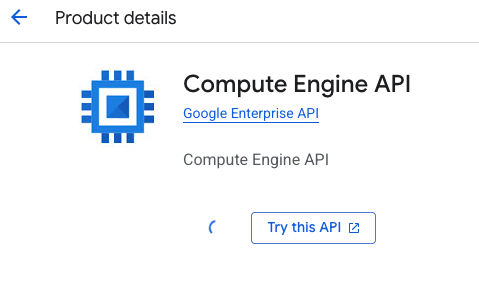  
You should now see a page proposing to create a new instance. Click on "Create instance".
Fill in the following fields in __Machine configuration__ section:
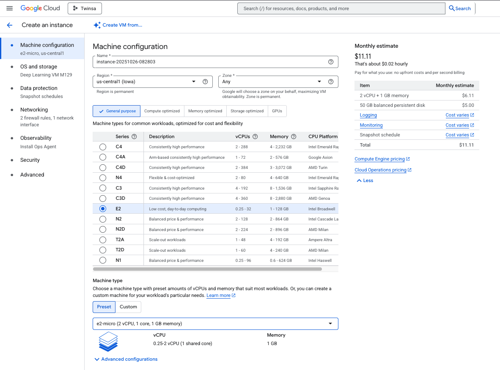  
Then in the __OS and Storage__ section, click on the "Change" button and select "Deep Learning in Linux" and select the first option.
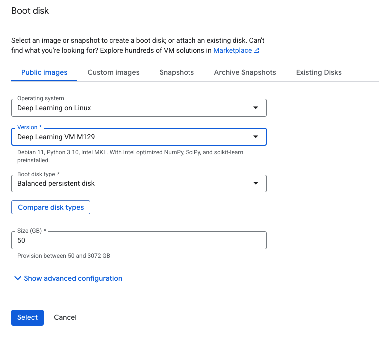  
Then in the __Networking__ section, set the following fields:
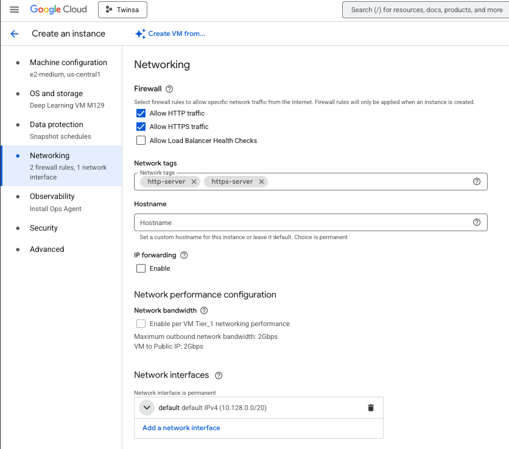  
In this same Networking section under __Network interfaces__, click the ▾ arrow next to
__default default IPv4 (10.128.0.0/20)__.

Find __External IPv4 address dropdown__  and select  __Reserve static address__.
Give it a name like flask-static-ip and click on __Reserve__.
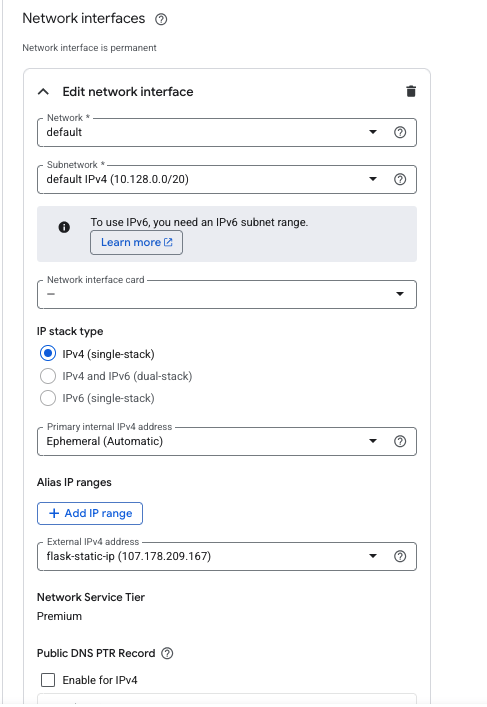  
Then click on the "Create" button to create the instance.

## 3. Install the GCloud SDK on your local machine
Now install the GCloud SDK on your local machine. Follow the instructions [here](https://cloud.google.com/sdk/docs/install).

Once the GCloud SDK is installed, run the following command to initialize it:
```console
gcloud init
```
This will guide you through the process of setting up your GCloud SDK. You will need to authenticate with your Google account and set a default project (Twinsa in our case). No need to set a default region.

## 4. Connect to your instance
Once your instance is created, you can find its name in the VM instances list on the Google Cloud Platform console.
You can connect to it using the following command (replace `your_instance_name` with the actual instance name):
```console
gcloud compute ssh --zone "us-central1-c" "your_instance_name"
```
You should now be connected to your instance and see its terminal.

## 5. Make a simple web app
On your local machine, create a new directory named `hello-world-flask-app`. Inside this directory, create a new file named `app.py` containing the following code:
```python
from flask import Flask

app = Flask(__name__)

@app.route('/')
def hello_world():
    return 'Hello, World!'

if __name__ == '__main__':
    app.run(debug=True, host='0.0.0.0', port=5000)
```

Let's create a file for the required dependencies. Create a new file named `requirements.txt` containing the following code:
```
flask
```

Now run the following command to start the web app:
```console
python app.py
```

Now you can access your web app at `http://localhost:5000`.

## 6. Deploy the web app on Google Cloud Platform
We will now deploy our web app on Google Cloud Platform.
To do so we will use the GCloud SDK to send the files to the instance and then start the web app.

Before that we will allow incoming traffic to the instance on port 5000.
To do so, run the following command on your local machine terminal (not on the instance):
```console
gcloud compute firewall-rules create allow-flask --allow tcp:5000
```

On the instance terminal (connect with `gcloud compute ssh --zone "us-central1-c" "your_instance_name"` in case you disconnected from the instance), run the following command to get your current working directory:
```console
pwd
```
This gives you the path to the home directory of the user on the instance.  

You should see something like `/home/your_username`.
Now on a separate terminal on your local machine run the following command to send the folder to the instance:
```console
gcloud compute scp --recurse --zone "us-central1-c" "path_to_your_folder/hello-world-flask-app" "your_instance_name":/home/your_username/
```

Then on the instance terminal, go to the folder:
```console
cd hello-world-flask-app
```
and run the following command to install the dependencies:
```console
pip install -r requirements.txt
```
Then start the web app:
```console
python app.py
```

Now go to the Google Cloud Platform console to get the external IP address of your instance.
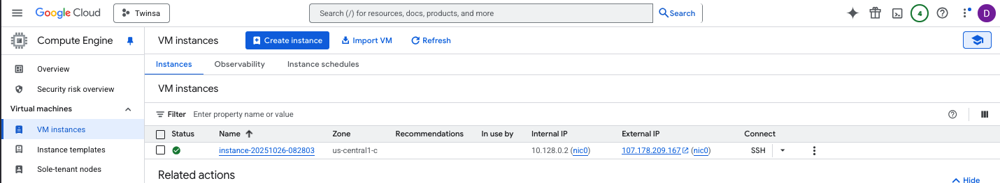  

You should now be able to access your web app at `http://your_instance_ip:5000`.
If everything is working, you should see your web app displaying "Hello, World!".
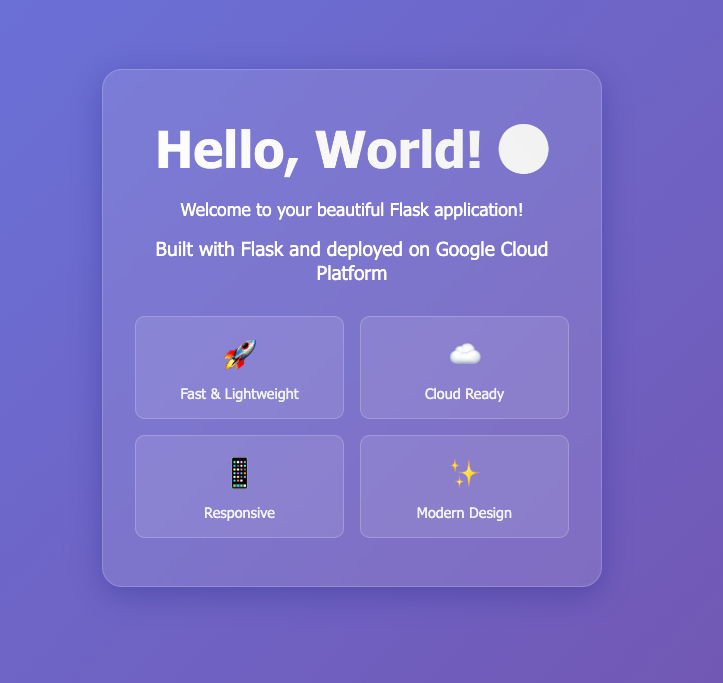

**Important:** Before moving to the next section, stop the Flask app running on the instance by pressing `Ctrl+C` in the instance terminal. This will free up port 5000 for the automated deployment process.

## 7. Continuous deployment
We will now deploy our web app on Google Cloud Platform using a continuous integration pipeline.
To do so we will use the GCloud SDK to send the files to the instance and then start the web app.

First, we will create a new repository on GitHub.
You can make this repository either public or private - it doesn't matter for our setup since GitHub Actions will handle the deployment via SSH, not by cloning the repository on the VM.
Go to [GitHub](https://github.com/) and create a new repository named `hello-world-flask-app` (choose either public or private visibility).

On the local folder `hello-world-flask-app`, first create a `.gitignore` file to prevent committing sensitive files:
```console
echo "github_action_key" > .gitignore
echo "github_action_key.pub" >> .gitignore
```

Now initialize a new git repository with `main` as the default branch:
```console
git init -b main
```

Add all the files to the repository:
```console
git add .
```
Commit the changes:
```console
git commit -m "Initial commit"
```
Add a remote repository:
```console
git remote add origin https://github.com/your_username/hello-world-flask-app.git
``` 
Push the changes to the repository:
```console
git push -u origin main
```

We will now create a new SSH key for the remote instance.
Run the following command on your local machine to create a new SSH key:
```console
ssh-keygen -t rsa -b 4096 -C "github-action" -f ./github_action_key
```
Do not enter a passphrase and press enter twice.
This should create a new file named `github_action_key` and `github_action_key.pub` in the local folder `hello-world-flask-app`.

You can now put the contents of github_action_key.pub inside the VM’s ~/.ssh/authorized_keys file:
1. Copy the contents of github_action_key.pub to the clipboard.
2. Run the following command on the instance terminal:
```console
mkdir -p ~/.ssh
echo "PASTE_YOUR_PUBLIC_KEY_HERE" >> ~/.ssh/authorized_keys
chmod 700 ~/.ssh
chmod 600 ~/.ssh/authorized_keys
```
3. On your local machine, inside the folder containing the github_action_key.pub file, run the following command (replace your_username and your_instance_external_ip with the correct values.):
```console
ssh -i github_action_key your_username@your_instance_external_ip
```
Your instance external IP is the one you got from the Google Cloud Platform console.   and you can find your username in the instance terminal by running the following command:
```console
whoami
```

If everything is working, you should see your remote instance terminal and you can go to the next step.

4. We will now add the SSH key to the GitHub repository as a secret.
Go to your GitHub repository → Settings → Secrets and variables → Actions → New repository secret.
Add these secrets (one by one):
- __GCP_SSH_PRIVATE_KEY__: The contents of the github_action_key file.
- __GCP_VM_IP__: The external IP of your instance.
- __GCP_VM_USER__: The username of the user on the instance.
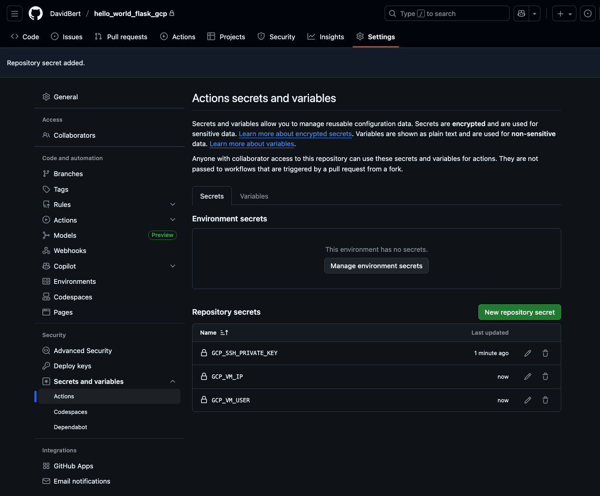  


5. We will now create the deployment workflow.

First we will make a small script to start the web app.
Create a new file named `start_app.sh` containing the following code:
```bash
#!/bin/bash
set -e

# Navigate to app directory
cd "$(dirname "$0")"

# Kill any existing instance
pkill -f 'python app.py' || true
sleep 1

# Start the app in background
nohup python app.py > app.log 2>&1 &
PID=$!

# Save PID
echo $PID > app.pid
echo "Started Flask app with PID: $PID"

# Wait a moment and verify it's still running
sleep 2
if kill -0 $PID 2>/dev/null; then
    echo "App is running successfully!"
    exit 0
else
    echo "App failed to start. Check app.log for details."
    exit 1
fi
```

This script will start the web app in a background process and save the PID to a file.
It will also verify that the app is running successfully.

We will now create the deployment workflow.
On the local folder `hello-world-flask-app`, create a new folder named `.github` and inside it create a new folder named `workflows` and inside it create a new file named `deploy.yml` containing the following code:
```yaml
name: Deploy to GCP VM

on:
  push:
    branches: ["main"]
  workflow_dispatch:

env:
  APP_DIR: /home/${{ secrets.GCP_VM_USER }}/apps/hello_world_flask_gcp

jobs:
  deploy:
    runs-on: ubuntu-latest

    steps:
    - name: Checkout code
      uses: actions/checkout@v4

    - name: Setup SSH
      uses: webfactory/ssh-agent@v0.9.0
      with:
        ssh-private-key: ${{ secrets.GCP_SSH_PRIVATE_KEY }}

    - name: Add VM to known_hosts
      run: ssh-keyscan -H ${{ secrets.GCP_VM_IP }} >> ~/.ssh/known_hosts

    - name: Deploy code to VM
      run: |
        ssh ${{ secrets.GCP_VM_USER }}@${{ secrets.GCP_VM_IP }} "mkdir -p ${{ env.APP_DIR }}"
        rsync -az --exclude ".git" --exclude ".github" ./ ${{ secrets.GCP_VM_USER }}@${{ secrets.GCP_VM_IP }}:${{ env.APP_DIR }}/

    - name: Install dependencies
      run: |
        ssh ${{ secrets.GCP_VM_USER }}@${{ secrets.GCP_VM_IP }} "
          cd ${{ env.APP_DIR }}
          sudo apt-get install -y python3 python3-pip
          sudo pip install -r requirements.txt
        "

    - name: Start application
      run: |
        ssh ${{ secrets.GCP_VM_USER }}@${{ secrets.GCP_VM_IP }} "
          cd ${{ env.APP_DIR }}
          chmod +x start_app.sh
          ./start_app.sh
        "

    - name: Verify deployment
      run: |
        ssh ${{ secrets.GCP_VM_USER }}@${{ secrets.GCP_VM_IP }} "
          curl -f http://localhost:5000/
          echo 'Deployment successful!'
        "
```

Commit and push to main:
```console
git add .
git commit -m "Add deployment workflow"
git push origin main
```

## 8. Make the app nicer to demonstrate continuous deployment
Now let's improve the look of our application to demonstrate that continuous deployment is working properly.

Create a new folder named `templates` in the `hello-world-flask-app` directory and inside it create a new file named `index.html` containing the following code:
```html
<!DOCTYPE html>
<html lang="en">
<head>
    <meta charset="UTF-8">
    <meta name="viewport" content="width=device-width, initial-scale=1.0">
    <title>Hello World - Flask App</title>
    <style>
        * {
            margin: 0;
            padding: 0;
            box-sizing: border-box;
        }

        body {
            font-family: 'Segoe UI', Tahoma, Geneva, Verdana, sans-serif;
            background: linear-gradient(135deg, #667eea 0%, #764ba2 100%);
            min-height: 100vh;
            display: flex;
            align-items: center;
            justify-content: center;
            color: white;
        }

        .container {
            text-align: center;
            background: rgba(255, 255, 255, 0.1);
            backdrop-filter: blur(10px);
            border-radius: 20px;
            padding: 3rem 2rem;
            box-shadow: 0 8px 32px 0 rgba(31, 38, 135, 0.37);
            border: 1px solid rgba(255, 255, 255, 0.18);
            max-width: 500px;
            width: 90%;
        }

        h1 {
            font-size: 3rem;
            margin-bottom: 1rem;
            background: linear-gradient(45deg, #fff, #f0f0f0);
            -webkit-background-clip: text;
            -webkit-text-fill-color: transparent;
            background-clip: text;
            animation: fadeInUp 1s ease-out;
        }

        .subtitle {
            font-size: 1.2rem;
            margin-bottom: 2rem;
            opacity: 0.9;
            animation: fadeInUp 1s ease-out 0.2s both;
        }

        .features {
            display: grid;
            grid-template-columns: repeat(auto-fit, minmax(150px, 1fr));
            gap: 1rem;
            margin-top: 2rem;
        }

        .feature {
            background: rgba(255, 255, 255, 0.1);
            padding: 1rem;
            border-radius: 10px;
            border: 1px solid rgba(255, 255, 255, 0.2);
            animation: fadeInUp 1s ease-out 0.4s both;
        }

        .feature-icon {
            font-size: 2rem;
            margin-bottom: 0.5rem;
        }

        .feature-text {
            font-size: 0.9rem;
            opacity: 0.9;
        }

        .welcome-message {
            font-size: 1.1rem;
            margin-bottom: 1rem;
            opacity: 0.95;
            animation: fadeInUp 1s ease-out 0.1s both;
        }

        @keyframes fadeInUp {
            from {
                opacity: 0;
                transform: translateY(30px);
            }
            to {
                opacity: 1;
                transform: translateY(0);
            }
        }

        .pulse {
            animation: pulse 2s infinite;
        }

        @keyframes pulse {
            0% {
                transform: scale(1);
            }
            50% {
                transform: scale(1.05);
            }
            100% {
                transform: scale(1);
            }
        }

        @media (max-width: 768px) {
            .container {
                padding: 2rem 1rem;
            }

            h1 {
                font-size: 2.5rem;
            }

            .features {
                grid-template-columns: 1fr;
            }
        }
    </style>
</head>
<body>
    <div class="container">
        <h1 class="pulse">Hello, World! 🌍</h1>
        <p class="welcome-message">Welcome to your beautiful Flask application!</p>
        <p class="subtitle">Built with Flask and deployed on Google Cloud Platform</p>

        <div class="features">
            <div class="feature">
                <div class="feature-icon">🚀</div>
                <div class="feature-text">Fast & Lightweight</div>
            </div>
            <div class="feature">
                <div class="feature-icon">☁️</div>
                <div class="feature-text">Cloud Ready</div>
            </div>
            <div class="feature">
                <div class="feature-icon">📱</div>
                <div class="feature-text">Responsive</div>
            </div>
            <div class="feature">
                <div class="feature-icon">✨</div>
                <div class="feature-text">Modern Design</div>
            </div>
        </div>
    </div>
</body>
</html>
```

Now modify the `app.py` file to use the template:
```python
from flask import Flask, render_template

app = Flask(__name__)

@app.route('/')
def hello_world():
    return render_template('index.html')

if __name__ == '__main__':
    app.run(debug=True, host='0.0.0.0', port=5000)
```

Commit and push these changes to trigger the continuous deployment:
```console
git add .
git commit -m "Add beautiful HTML template"
git push origin main
```

Go to your GitHub repository and check the Actions tab. You should see the deployment workflow running.
Once it's done, refresh your web app at `http://your_instance_ip:5000` and you should see the new beautiful interface!

This demonstrates that your continuous deployment pipeline is working correctly - any changes you push to the main branch will automatically be deployed to your GCP instance.

## 9. Troubleshooting

Here are common issues you might encounter and their solutions:

### Firewall Issues
**Problem:** Cannot access the web app via external IP.
**Solution:**
- Verify the firewall rule was created: `gcloud compute firewall-rules list`
- Make sure the rule allows tcp:5000
- Check if the app is actually running on the instance: `curl http://localhost:5000` from the instance terminal

### SSH Connection Problems
**Problem:** Cannot SSH into the instance.
**Solution:**
- Verify the instance is running in the GCP console
- Check your zone is correct (should be `us-central1-c`)
- Try adding `--verbosity=debug` to the SSH command to see detailed error messages
- Make sure your gcloud SDK is authenticated: `gcloud auth list`

### Port Already in Use
**Problem:** Error message "Address already in use" when starting the app.
**Solution:**
- Find the process using port 5000: `sudo lsof -i :5000`
- Kill the process: `kill -9 <PID>` (replace `<PID>` with the actual process ID)
- Or use: `pkill -f 'python app.py'`

### GitHub Actions Workflow Failures
**Problem:** The deployment workflow fails.
**Solution:**
- Check the Actions tab on GitHub for detailed error logs
- Verify all three secrets (GCP_SSH_PRIVATE_KEY, GCP_VM_IP, GCP_VM_USER) are correctly set
- Make sure the SSH key authentication works: test manually with `ssh -i github_action_key your_username@your_instance_ip`
- Verify the app directory path in the workflow matches your setup

### App Fails to Start
**Problem:** The app starts but immediately crashes.
**Solution:**
- Check the app.log file: `cat ~/apps/hello_world_flask_gcp/app.log`
- Verify all dependencies are installed: `pip list | grep -i flask`
- Make sure the templates folder exists and contains index.html (for Section 8)
- Check for Python syntax errors in app.py

### Template Not Found Error
**Problem:** "TemplateNotFound: index.html" error.
**Solution:**
- Verify the templates folder exists in the same directory as app.py
- Check the folder name is exactly `templates` (plural, lowercase)
- Make sure index.html is inside the templates folder
- Restart the app after adding the template

## 10. Cleanup
To cleanup, you can stop the instance from the Google Cloud Platform console.
You can delete it if you want to completely remove it but you might want to keep it for future your project since it is configured now. If you choose to keep it, you can start it again later. Always remember to stop the instance when you are not using it to avoid unnecessary charges. You have a limited 50$ credit so be careful with your usage.
You can also delete the repository from GitHub or keep it if it can help you in the future and the same for the SSH key and the local folder `hello-world-flask-app`.

