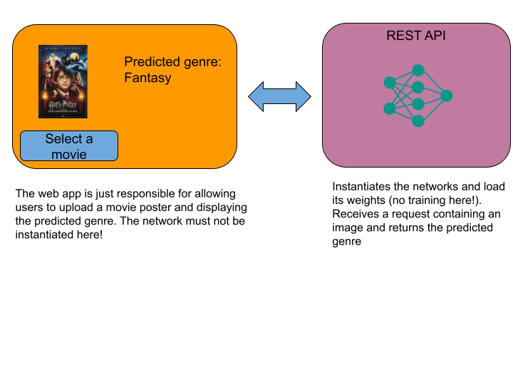
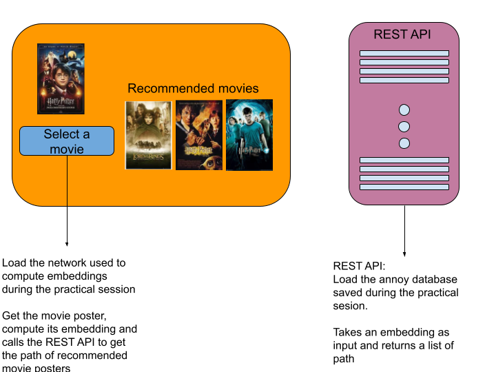

# Project:
Welcome to the final project presentation page!  
In the following, you will find the instructions for the project that you will have to complete during the course.  
This project will be composed of 4 parts.  
I tried to build it in a way that would make you use all the tools and frameworks that we will see in class and that would let you start working each individual part once you have completed the corresponding practical session.  

We will build a web application that will help users to perform many operations about movies like:
- predicting the genre of a movie according to its plot or its poster
- recommending movies according to the posters or their plots
- detect wether an image is a poster of a movie

During the last hour of every second practical session, you are allowed to start working on the project.  
I really recommend you to do so, but I also encourage you to finish the corresponding practical session before starting the project.  
I will provide you with a solution for the practical session that you can use as a reference.

### Part 1: Development tools for Data Scientist

You should now have completed practical sessions associated to the project.
If not I would recommend to do them before continuing.

In the practical sessions, you should have learned how to use docker and how to create a rest API using flask.  
In parallel, you should have learned in HDDL how to use a pre-trained model and how to fine-tune it to perform a new task.  

For this first part of the project, I would like you to train a pretrained model to predict the genre of a movie according to its poster.  
Then you will have to create a rest API to predict the genre of a movie according to its poster. 
Then use gradio to create a web interface that calls this API and allows users to upload a movie poster and get the predicted genre.  
Once all this is done, you will have to create a docker file to package your API and web interface and push it to a github repository that you will have to share with me.   
Please do not store the models weights in your repository, but rather on a cloud like Google drive and make your docker file download them at runtime.

#### Dataset:
I created a dataset of movie posters and their corresponding genres.  
Posters are stored in their corresponding genre folder in such a way that it is easy for you to load with the `torchvision.datasets.ImageFolder` class. 
You can download it [here](https://drive.google.com/file/d/1-1OSGlN2EOqyZuehBgpgI8FNOtK-caYf/view?usp=sharing).  
Do not store it in your Github repository!

#### Additional help:
An easy way to run both the web app and the REST API in a single  container would consist to create a bash script that runs both the web app and the API service.  
This is not the best practice, but it might be easier for you to do so. Thus you can start with this solution and then try to run the web app and the annoy index in two different containers.

Here is an example of a bash script that runs both the web app and the rest API:  
```bash
#!/bin/bash
python python api.py &  gradio_app.py 
```

The ``&`` operator is used to put jobs in the background.  
Here the API service is run in the background and the web app is run in the foreground.  
Call this script in your docker file to run the application.

The good practice consists in runnnig the web app in a docker container and the API in another container.  
To do so you can use docker-compose. 
Look at the [docker-compose documentation](https://docs.docker.com/compose/gettingstarted/) to learn how to use it. 

Here are the theroritical steps to follow to run the web app and the API in two different containers using docker-compose.  
First, you need to create Dockerfiles for both the Gradio web app and the API.  
Then create a docker-compose.yml file to define and run the multi-container Docker applications. For exemple something like:  

```yaml	
version: '3.8'
services:
  gradio-app:
    build:
      context: .
      dockerfile: Dockerfile-gradio
    ports:
      - "7860:7860"
    depends_on:
      - model_api

  model_api:
    build:
      context: .
      dockerfile: Dockerfile-api
    ports:
      - "5000:5000"
```
Make sure in your gradio app to call the API through the url `http://model_api:5000/` as the base URL for API requests.

To run the application, run the following command in the same directory as the docker-compose.yml file:

```bash
docker-compose up
```

The Gradio web app should be accessible at http://localhost:7860.  
The REST API, if it has endpoints exposed, will be accessible at http://localhost:5000.

To stop and remove the containers, networks, and volumes created by docker-compose up, run:
    
```bash
docker-compose down
```


### Part 2: Recommendation systems

During the practical session, you saw how to build a recommender system based on content using the movie posters.  
Use `Gradio` to build a web app that takes as input a movie poster and returns the images of the 5 most similar movies according to their poster.  
I would like you to mimic a real recommender system using a vector database.  
To do so I want the database to be requested by the web app through a REST API. 
The web app should be light and fast.  
Use a pre-trained network only to extract the vector representation of the input image and call through the REST API the annoy index you built during the practical session to find the 5 most similar movies.
    

For the sake of simplicity, I would recommend you to use the same network you used in the previous part and just adding a new route to the API to return the 5 most similar movies.  
#### Dataset:
Use the same dataset as in the practical session.  

#### Additional help:
You can find a small example of how to create and orchestrate both the API and the web interface using docker compose [here](Docker_compose_annoy.md).
Try to understand how it works and then modify it to fit the project.

