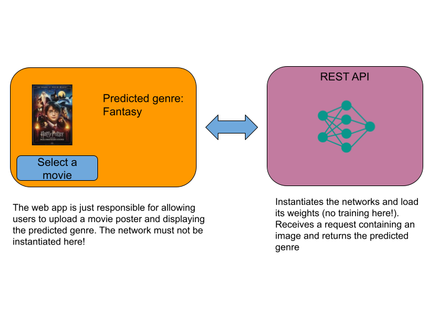

# Project:
Welcome to the final project presentation page!  
In the following, you will find the instructions for the project that you will have to complete during the course.  
This project will be composed of 4 parts.  
I tried to build it in a way that would make you use all the tools and frameworks that we will see in class and that would let you start working each individual part once you have completed the corresponding practical session.  

We will build a web application that will help users to perform many operations about movies like:
- predicting the genre of a movie according to its plot or its poster
- recommending movies according to the posters or their plots
- detect wether an image is a poster of a movie

During the last hour of every second practical session, you are allowed to start working on the project.  
I really recommend you to do so, but I also encourage you to finish the corresponding practical session before starting the project.  
I will provide you with a solution for the practical session that you can use as a reference.

# Project part 1: Development tools for Data Scientist

You should now have completed practical sessions associated to the project.
If not I would recommend to do them before continuing.

In the practical sessions, you should have learned how to use docker and how to create a rest API using flask.  
In parallel, you should have learned in HDDL how to use a pre-trained model and how to fine-tune it to perform a new task.  

For this first part of the project, I would like you to train a pretrained model to predict the genre of a movie according to its poster.  
Then you will have to create a rest API to predict the genre of a movie according to its poster. 
Then use gradio to create a web interface that calls this API and allows users to upload a movie poster and get the predicted genre.  
Once all this is done, you will have to create a docker file to package your API and web interface and push it to a github repository that you will have to share with me.   
Please do not store the models weights in your repository, but rather on a cloud like Google drive and make your docker file download them at runtime.

### Dataset:
I created a dataset of movie posters and their corresponding genres.  
Posters are stored in their corresponding genre folder in such a way that it is easy for you to load with the `torchvision.datasets.ImageFolder` class. 
You can download it [here](https://github.com/DavidBert/AIF/blob/main/project/project_part1_dataset.zip).  
Do not store it in your Github repository!

