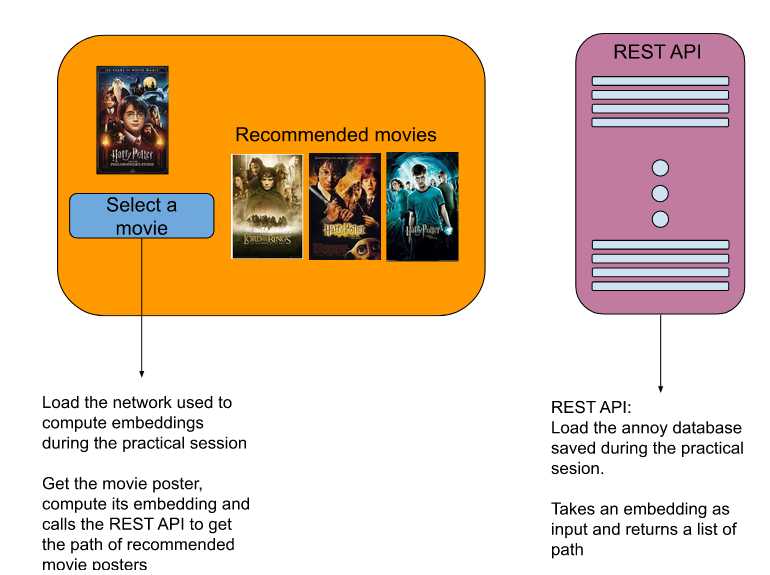

# Recommendation Systems

## Course:

*   [Slides recommender systems](https://docs.google.com/presentation/d/1xUMmOn3vUXv8YgPmvTeXMLXDcSyOB9Sa8lLL2N2AXqk/edit?usp=sharing)  


<iframe width="560" height="315" src="https://www.youtube.com/embed/5TYgk0jZApc?si=NXGtORCgbxbQLJkj" title="YouTube video player" frameborder="0" allow="accelerometer; autoplay; clipboard-write; encrypted-media; gyroscope; picture-in-picture; web-share" allowfullscreen></iframe>

<iframe width="560" height="315" src="https://www.youtube.com/embed/Z5Vyx5AMnns?si=3Y7KOsqaoCSQRRjP" title="YouTube video player" frameborder="0" allow="accelerometer; autoplay; clipboard-write; encrypted-media; gyroscope; picture-in-picture; web-share" allowfullscreen></iframe>

<iframe width="560" height="315" src="https://www.youtube.com/embed/Hs-wURnnEwg?si=pqol8S2JlmY-lnrF" title="YouTube video player" frameborder="0" allow="accelerometer; autoplay; clipboard-write; encrypted-media; gyroscope; picture-in-picture; web-share" allowfullscreen></iframe>

<iframe width="560" height="315" src="https://www.youtube.com/embed/ztMvKeSOye8?si=k75YUUHzW7bpsAq-" title="YouTube video player" frameborder="0" allow="accelerometer; autoplay; clipboard-write; encrypted-media; gyroscope; picture-in-picture; web-share" allowfullscreen></iframe>

<iframe width="560" height="315" src="https://www.youtube.com/embed/eZHGfpP-FKQ?si=rTxfohLS737b1Bxq" title="YouTube video player" frameborder="0" allow="accelerometer; autoplay; clipboard-write; encrypted-media; gyroscope; picture-in-picture; web-share" allowfullscreen></iframe>

<iframe width="560" height="315" src="https://www.youtube.com/embed/fiSHiAKxuNo?si=wfZVN3ZT75reBP_U" title="YouTube video player" frameborder="0" allow="accelerometer; autoplay; clipboard-write; encrypted-media; gyroscope; picture-in-picture; web-share" allowfullscreen></iframe>

## Practical session:
*   IMDB recommender system: [](https://colab.research.google.com/github/DavidBert/AIF/blob/main/rec_sys/recommender_systems/INSA_Reco.ipynb)

*   Solution: [](https://colab.research.google.com/github/DavidBert/AIF/blob/solutions/rec_sys/recommender_systems/INSA_Reco_solution.ipynb)

<!-- ## Project:

During the practical session, you saw how to build a recommender system based on content using the movie posters.  
Use `Gradio` to build a web app that takes as input a movie poster and returns the images of the 5 most similar movies according to their poster.  
I would like you to mimic a real recommender system using a vector database.  
To do so I want the database to be requested by the web app through a REST API. 
The web app should be light and fast.  
Use a pre-trained network only to extract the vector representation of the input image and call through the REST API the annoy index you built during the practical session to find the 5 most similar movies.
    


An easy way to run both the web app and the annoy index in a single  container would consist to create a bash script that runs both the web app and the annoy index.  
This is not the best practice, but it might be easier for you to do so. Thus you can start with this solution and then try to run the web app and the annoy index in two different containers.

Here is an example of a bash script that runs both the web app and the annoy index:  
```bash
#!/bin/bash
python python annoy_db.py &  gradio_app.py 
```

The ``&`` operator is used to put jobs in the background.  
Here the annoy index is run in the background and the web app is run in the foreground.  
Call this script in your docker file to run the application.

The good practice consists in runnnig the web app in a docker container and the annoy index in another container.  
To do so you can use docker-compose. 
Look at the [docker-compose documentation](https://docs.docker.com/compose/gettingstarted/) to learn how to use it. 

Here are the theroritical steps to follow to run the web app and the annoy index in two different containers using docker-compose.  
First, you need to create Dockerfiles for both the Gradio web app and the Annoy database.  
Then create a docker-compose.yml file to define and run the multi-container Docker applications. For exemple something like:  

```yaml	
version: '3.8'
services:
  gradio-app:
    build:
      context: .
      dockerfile: Dockerfile-gradio
    ports:
      - "7860:7860"
    depends_on:
      - annoy-db

  annoy-db:
    build:
      context: .
      dockerfile: Dockerfile-annoy
    ports:
      - "5000:5000"
```
Make sure in your gradion app to call the annoy database through the url `http://annoy-db:5000/` as the base URL for API requests.

To run the application, run the following command in the same directory as the docker-compose.yml file:

```bash
docker-compose up
```

The Gradio web app should be accessible at http://localhost:7860.  
The Annoy database API, if it has endpoints exposed, will be accessible at http://localhost:5000.

To stop and remove the containers, networks, and volumes created by docker-compose up, run:
    
```bash
docker-compose down
``` -->